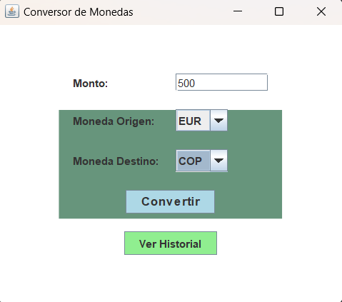
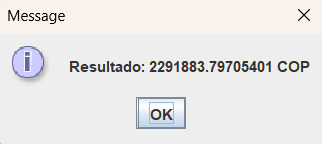
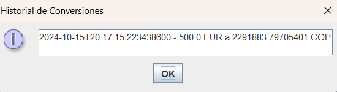

# Conversor de Monedas

Este es un proyecto para ONE-Alura, Challenger de conversor de monedas que utiliza una API para obtener las tasas de cambio.


## Video de demostración

[![Video de demostración]

(https://youtu.be/iHCiBwgfBv4?si=7oZAwqYNip0i-P0H)

## Características
- Conversión entre múltiples monedas.
- Integración con API de tasas de cambio. https://www.exchangerate-api.com/
- Interfaz gráfica con menús desplegables.
- Historial de conversiones con marca de tiempo.

## Instalación
1. Clona este repositorio:
   ```bash
   git clone https://github.com/usuario/conversor-monedas.git
   ```
2. Importa el proyecto en tu IDE.
3. Asegúrate de tener configurada la JDK (Java Development Kit).
4. Añade la dependencia del API JSON si es necesario.
5. Ejecuta el archivo `Main.java`.

## Uso
- Ingresa el monto a convertir.
- Selecciona la moneda de origen y la moneda destino.
- Haz clic en el botón "Convertir" para obtener el resultado.

## Historial de Conversiones
- El historial muestra las últimas conversiones realizadas con su respectiva fecha y hora.

## Dependencias
- `org.json`: Biblioteca utilizada para manejar los datos JSON.
- `javax.swing`: Para la interfaz gráfica del usuario.

## Licencia
Este proyecto está licenciado bajo los términos de la Licencia MIT.

## Autores
- Lina Marcela Tangarife Sánchez